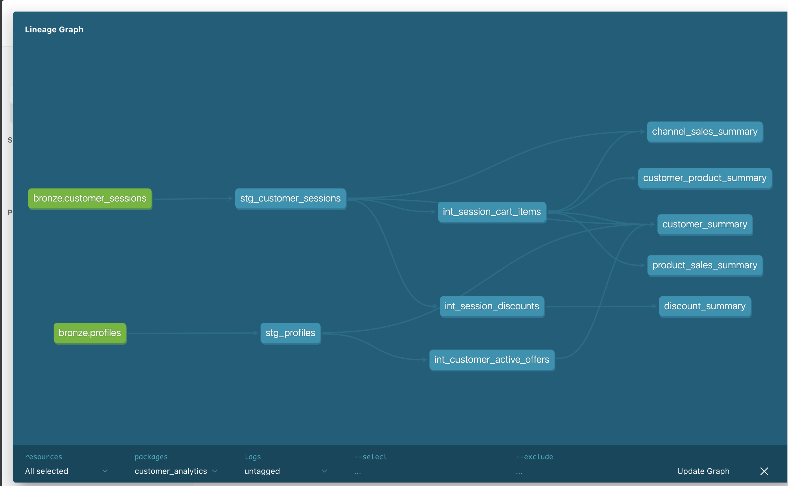

# Customer Analytics Data Platform

A production-inspired data platform that ingests raw Change Data Capture (CDC) events, reconstructs the latest business state, and builds analyst-ready analytical marts using **Python**, **DuckDB**, and **dbt**.

The project demonstrates a modern ELT workflow from raw JSON files to business-ready datasets that support reporting, dashboards, and downstream analytics.

---

# Features

- Incremental and idempotent ingestion of CDC events
- CDC-aware deduplication pipeline that reconstructs the latest business state
- Layered data architecture (Bronze → Staging → Intermediate → Gold)
- Normalization of nested JSON into reusable business entities
- Analyst-ready aggregated marts
- Fully local execution using DuckDB and dbt

---

# Problem Statement

The source system produces raw CDC events for customer profiles and shopping sessions.

These events are not directly suitable for analytics because they contain:

- Multiple versions of the same business entity
- Nested JSON structures
- Insert, Update, and Delete events
- Semi-structured customer and transaction attributes

This project transforms the raw data into clean, normalized, and analyst-friendly datasets.

---

# Solution Architecture

```text
                  Raw JSON Files
                        │
                        ▼
               Python Ingestion Layer
         (Incremental & Idempotent Loading)
                        │
                        ▼
                 Bronze (Raw CDC)
                        │
                        ▼
            dbt Staging (Latest State)
                        │
                        ▼
        dbt Intermediate (Normalized)
                        │
                        ▼
          dbt Gold (Analytical Marts)
```
---
# CDC & Deduplication Strategy

The source datasets contain Change Data Capture (CDC) events, where multiple records may exist for the same business entity over time.

The platform follows a layered approach:

- **Bronze** preserves every CDC event exactly as received.
- **Staging** reconstructs the latest business state by selecting the most recent event for each business key using the CDC timestamp.
- **Intermediate** normalizes nested business entities into reusable analytical tables.
- **Gold** provides aggregated marts for reporting and analytics.

This design preserves the complete event history while exposing a deduplicated and analyst-friendly view of the data.

---

# dbt Model Lineage

The transformation pipeline is implemented using dbt and follows a layered modeling approach from Bronze to analyst-ready Gold marts.



---

# Repository Structure

```text
customer-analytics-data-platform/

├── ingestion/                 # Python ingestion pipeline
├── dbt/                       # dbt transformation project
│   ├── models/
│   ├── macros/
│   └── dbt_project.yml
├── data/
│   ├── raw/                   # Source JSON files
│   └── warehouse/             # DuckDB database
├── docs/
│   ├── ingestion-architecture.md
│   └── data-discovery-and-modeling.md
|   └── gold-layer.md
├── pyproject.toml
├── uv.lock
├── .env.example
└── README.md
```

---

# Technology Stack

- Python
- DuckDB
- dbt
- uv

---

# Prerequisites

Install:

- Python 3.12+
- uv

Install project dependencies:

```bash
uv sync
```

---

# Local Setup

## 1. Clone the repository

```bash
git clone <repository-url>
cd customer-analytics-data-platform
```

## 2. Configure environment

Create a `.env` file from the provided `.env.example`.

## 3. Run the ingestion pipeline

```bash
uv run python -m ingestion.main
```

This will:

- Create the DuckDB database (if it does not already exist)
- Create the Bronze schema and tables
- Load incremental CDC events from the raw JSON files

---

# Build the Data Models

Run all dbt models and tests:

```bash
cd dbt

uv run dbt build
```

This builds:

- Staging models
- Intermediate models
- Gold marts
- Data quality tests

---

# Analytical Marts

The Gold layer exposes analyst-ready marts.

| Mart | Description |
|------|-------------|
| `customer_summary` | Customer profile, loyalty, and shopping metrics |
| `customer_product_summary` | Customer purchasing behaviour by product |
| `product_sales_summary` | Product sales and revenue performance |
| `channel_sales_summary` | Sales performance by shopping channel |
| `discount_summary` | Promotion and discount effectiveness |

These marts are designed for dashboards, reporting, and ad-hoc analytics.

---

# Supported Business Questions

The analytical marts enable answering questions such as:

### Customer Analytics

- Who are the highest-value customers?
- Which loyalty tiers generate the most revenue?
- How many shopping sessions has each customer completed?

### Customer Purchasing Behaviour

- Which products does each customer purchase most frequently?
- Which products generate the highest revenue per customer?

### Product Analytics

- Which products generate the highest revenue?
- Which products are purchased the most?
- Which brands and categories perform best?

### Channel Analytics

- Which sales channel generates the highest revenue?
- What is the average order value by channel?

### Promotion Analytics

- Which discounts are used most frequently?
- Which promotions provide the highest total discount?

---

# Project Documentation

The project is documented in detail to explain the design decisions and implementation.

| Document | Description |
|----------|-------------|
| [docs/ingestion-architecture.md](docs/ingestion-architecture.md) | Python ingestion architecture, transaction management, checkpointing, and idempotent loading |
| [docs/data-discovery-and-modeling.md](docs/data-discovery-and-modeling.md) | Source data exploration, business entities, CDC strategy, and modeling decisions |
| [docs/gold-layer.md](docs/gold-layer.md) | Gold layer design, analytical marts, and supported business use cases |

---

# Design Principles

- Layered ELT architecture
- Incremental and idempotent ingestion
- CDC-aware data modeling
- Clear separation of Bronze, Staging, Intermediate, and Gold layers
- Normalized business entities before aggregation
- Simple, maintainable, and production-inspired design
