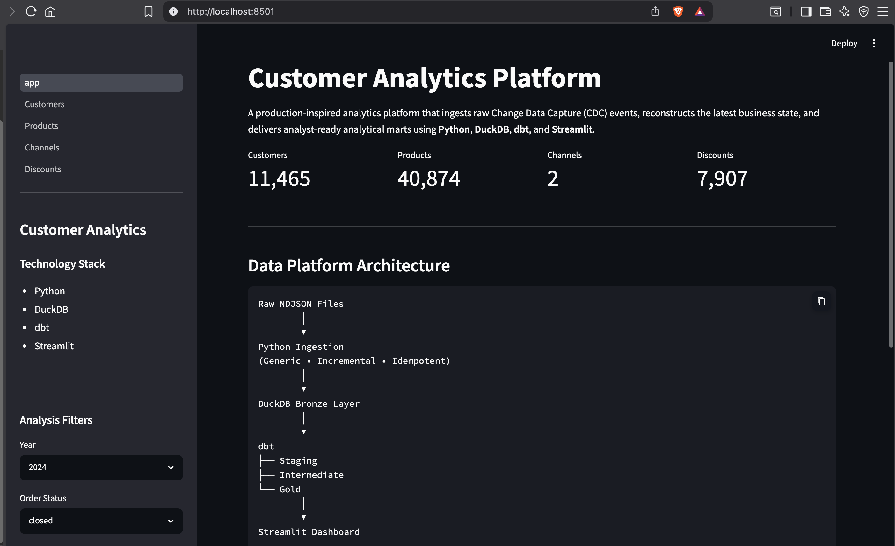
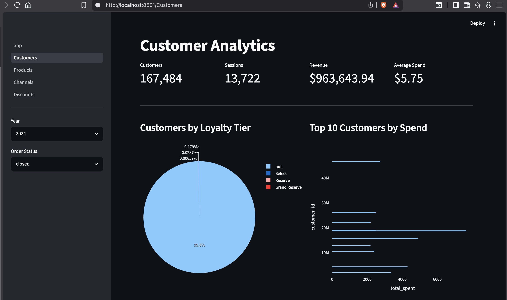
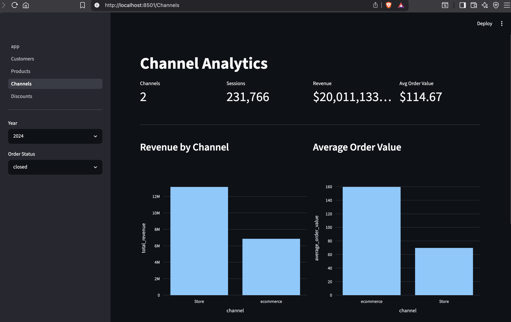
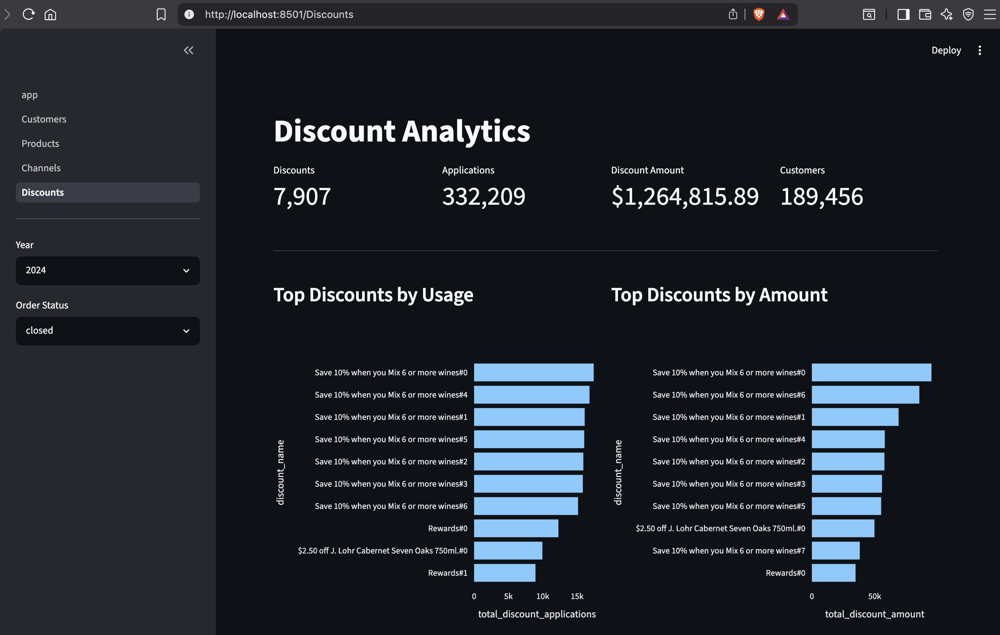

# Customer Analytics Data Platform

A production-inspired data platform that ingests raw **Change Data Capture (CDC)** events, reconstructs the latest business state, and builds analyst-ready analytical marts using **Python**, **DuckDB**, **dbt**, and **Streamlit**.

The project demonstrates a modern ELT workflow from raw JSON files to business-ready datasets that support reporting, dashboards, and downstream analytics.

---

# Features

- Incremental and idempotent ingestion of CDC events
- CDC-aware deduplication that reconstructs the latest business state
- Layered data architecture (Bronze → Staging → Intermediate → Gold)
- Normalization of nested JSON into reusable business entities
- Analyst-ready analytical marts
- Interactive Streamlit dashboard
- Fully local execution using DuckDB

---

# Problem Statement

The source system produces raw CDC events for customer profiles and shopping sessions.

These events are not directly suitable for analytics because they contain:

- Multiple versions of the same business entity
- Nested JSON structures
- Insert, Update, and Delete events
- Semi-structured customer and transaction attributes

This project transforms the raw data into clean, normalized, and analyst-friendly datasets.

---

# Solution Architecture

```text
                  Raw NDJSON Files
                        │
                        ▼
              Python Ingestion Layer
        (Incremental & Idempotent)
                        │
                        ▼
                 Bronze (Raw CDC)
                        │
                        ▼
          dbt Staging (Latest State)
                        │
                        ▼
      dbt Intermediate (Normalized)
                        │
                        ▼
       dbt Gold (Analytical Marts)
                        │
                        ▼
           Streamlit Dashboard
```

---

# CDC & Deduplication Strategy

The source datasets contain Change Data Capture (CDC) events where multiple records may exist for the same business entity.

The platform follows a layered transformation strategy:

- **Bronze** preserves every CDC event exactly as received.
- **Staging** reconstructs the latest business state by selecting the latest event for each business key.
- **Intermediate** normalizes nested business entities into reusable analytical tables.
- **Gold** builds aggregated marts for reporting and analytics.

This approach preserves the complete event history while exposing a clean, deduplicated business view.

---

# Business Scope

The case study focuses on generating insights for **2024** sales, customers, and promotions.

To satisfy the requirement while keeping the solution reusable, every Gold mart includes:

| Dimension | Purpose |
|-----------|---------|
| `order_year` | Enables reporting for 2024 while supporting future years without model changes |
| `order_status` | Supports analysis of completed and non-completed shopping sessions |

According to the case study:

> **A shopping session with `order_status = 'Closed'` represents a completed purchase.**

Therefore, the Streamlit dashboard defaults to:

- **Year = 2024**
- **Order Status = Closed**

Keeping all order statuses enables additional operational insights including:

- Open shopping sessions
- Cancelled orders
- Purchase conversion analysis
- Shopping sessions that did not become completed purchases

---

# dbt Model Lineage

The transformation pipeline is implemented using dbt and follows a layered modeling approach.


---

# Repository Structure

```text
customer-analytics-data-platform/

├── ingestion/                     # Python ingestion framework
│   ├── config/
│   ├── database/
│   ├── models/
│   ├── pipelines/
│   ├── sql/
│   ├── utils/
│   ├── main.py
├── dbt/
│   ├── models/
│   │   ├── staging/
│   │   ├── intermediate/
│   │   ├── marts/
│   └── profiles.yml
│   └── dbt_project.yml
├── dashboard/
│   ├── app.py
│   ├── database.py
│   ├── filters.py
│   └── pages/
├── data/
│   ├── raw/
│   └── warehouse/
├── docs/
│   ├── images/
│   │   ├── dashboard-home.png
│   ├── ingestion-architecture.md
│   ├── data-discovery-and-modeling.md
│   └── gold-layer.md
├── pyproject.toml
├── uv.lock
├── .env.example
└── README.md
```

---

# Technology Stack

- Python
- DuckDB
- dbt
- Streamlit
- uv

---

# Prerequisites

Install:

- Python 3.12+
- uv

Install dependencies:

```bash
uv sync
```

---

# Local Setup

## Clone the repository

```bash
git clone <repository-url>

cd customer-analytics-data-platform
```

## Configure environment

```text
Copy .env.example to .env
```

## Run the ingestion pipeline

```bash
uv run python -m ingestion.main
```

The ingestion pipeline automatically:

- Creates the DuckDB database
- Creates Bronze schemas
- Loads raw CDC events
- Performs incremental and idempotent ingestion

---

# Build the Data Models

```bash
cd dbt

uv run dbt build
```

This builds:

- Staging models
- Intermediate models
- Gold marts
- Data quality tests

---

# View the dbt Documentation

Generate the dbt documentation:

```bash
cd dbt

uv run dbt docs generate
```

Launch the documentation website locally:

```bash
uv run dbt docs serve
```

The documentation includes:

- Model lineage graph
- Model dependencies
- Column-level metadata
- Data tests
- Model documentation

---
# Launch the Dashboard

```bash
cd dashboard

uv run streamlit run app.py
```

Open:

```text
http://localhost:8501
```

The dashboard defaults to:

- **Year = 2024**
- **Order Status = Closed**

matching the case study definition of completed purchases.

---

# Dashboard

The Streamlit dashboard provides interactive exploration of the Gold analytical marts.

## Home



---

## Customer Analytics



---

## Channel Analytics



---

## Discount Analytics




---

# Analytical Marts

| Mart | Description |
|------|-------------|
| `customer_summary` | Customer profile, loyalty, and shopping metrics by year and order status |
| `customer_product_summary` | Customer purchasing behaviour by product |
| `product_sales_summary` | Product sales performance |
| `channel_sales_summary` | Channel performance |
| `discount_summary` | Promotion and discount performance |

These marts are designed for dashboards, reporting, and ad-hoc analytics.

---

# Supported Business Questions

## Customer Analytics

- Who are the highest-value customers?
- Which loyalty tiers generate the most revenue?
- How many shopping sessions has each customer completed?

## Customer Purchasing Behaviour

- Which products does each customer purchase most frequently?
- Which products generate the highest revenue per customer?

## Product Analytics

- Which products generate the highest revenue?
- Which products sell the most?
- Which brands and categories perform best?

## Channel Analytics

- Which sales channel generates the highest revenue?
- What is the average order value by channel?

## Promotion Analytics

- Which discounts are used most frequently?
- Which promotions generate the largest discount amount?

## Operational Analytics

- How many shopping sessions did not result in a completed purchase?
- How many orders remain open or were cancelled?
- What is the conversion from shopping sessions to completed purchases?

---

# Project Documentation

| Document | Description |
|----------|-------------|
| [docs/ingestion-architecture.md](docs/ingestion-architecture.md) | Python ingestion architecture, transaction management, checkpointing, and idempotent loading |
| [docs/data-discovery-and-modeling.md](docs/data-discovery-and-modeling.md)  | Source data exploration, CDC strategy, business entities, and modeling decisions |
| [docs/gold-layer.md](docs/gold-layer.md) | Gold analytical marts, business metrics, and supported analytical use cases |

---

# Design Principles

- Layered ELT architecture
- Incremental and idempotent ingestion
- CDC-aware data modeling
- Separation of Bronze, Staging, Intermediate, and Gold layers
- Normalized business entities before aggregation
- Business-first analytical marts
- Simple, deterministic, and maintainable transformations
- Production-inspired engineering practices
