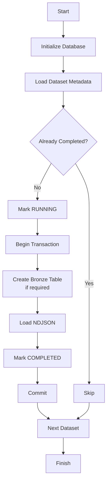
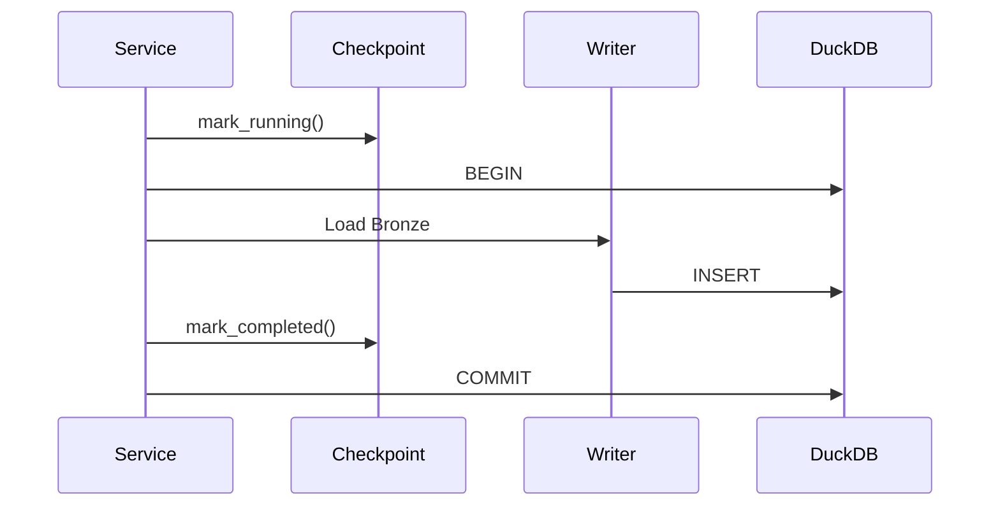

# Ingestion Architecture

## Overview

The ingestion layer loads raw NDJSON Change Data Capture (CDC) files into the Bronze layer of the data platform.

The implementation is designed to be:

- Generic
- Configuration-driven
- Incremental
- Idempotent
- Transactional
- Easy to extend

Python orchestrates the ingestion process, while DuckDB performs the heavy lifting for JSON parsing and loading.

---

# Architecture

```text
           Raw NDJSON Files
                    │
                    ▼
         Python Ingestion Layer
                    │
                    ▼
          DuckDB Bronze Layer
                    │
                    ▼
             dbt Transformations
         (Staging → Intermediate → Gold)
```

---

# Project Structure

```text
customer-analytics-data-platform/

├── data/                     
│   ├── raw/
│       ├── customer_sessions_1.json
│       ├── customer_sessions_2.json
│       ├── customer_sessions_3.json
│       ├── ....
│       ├── profiles1.json
│       ├── profiles1.json
│       ├── ....
│       ├── database/
│   ├── warehouse/              
├── ingestion/                     # Python ingestion framework
│   ├── config/
│   ├── database/
│   ├── models/
│   ├── pipelines/
│   ├── sql/
│   ├── utils/
├─── main.py

---

# Components

| Component | Responsibility |
|------------|----------------|
| `main.py` | Starts the ingestion pipeline |
| `DatabaseInitializer` | Creates required schemas and metadata tables |
| `IngestionService` | Orchestrates the ingestion workflow |
| `Checkpoint` | Tracks ingestion progress and prevents duplicate loads |
| `Writer` | Loads raw NDJSON files into Bronze |
| `DuckDBClient` | Database connection and transaction management |

---
# Ingestion Workflow



---

# Incremental & Idempotent Loading

The ingestion pipeline tracks every processed dataset in a metadata table.

Before loading a dataset, the pipeline checks whether it has already been successfully processed.

This ensures:

- Previously ingested datasets are skipped
- Failed datasets can be safely retried
- Duplicate Bronze records are not introduced

---

# Transaction Flow

Each dataset is processed within a single database transaction.



If any operation fails:

```text
ROLLBACK

↓

Bronze remains unchanged

↓

Checkpoint marked as FAILED
```
---

# Dataset Registration

Datasets are registered declaratively.

Each dataset defines:

- Source file
- Target Bronze table
- Schema metadata

The ingestion framework automatically handles:

- Table creation
- Type conversion
- Data loading

Adding a new dataset only requires registering its metadata.

---

# Running the Pipeline

Install dependencies:

```bash
uv sync
```

Run the ingestion pipeline:

```bash
uv run python -m ingestion.main
```

The pipeline automatically:

- Creates the DuckDB database (if required)
- Initializes schemas and metadata tables
- Loads the Bronze layer
- Records ingestion status

---

# Design Principles

- Configuration-driven architecture
- Generic ingestion framework
- Incremental and idempotent loading
- Transactional processing
- Separation of orchestration and database operations
- Simple, maintainable, and extensible design
