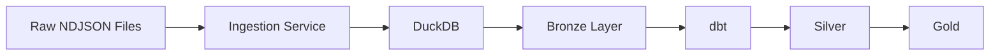
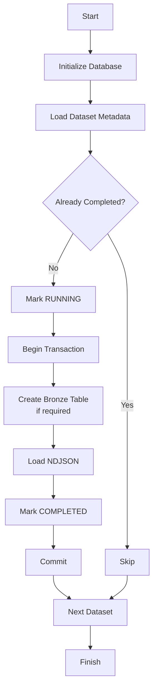
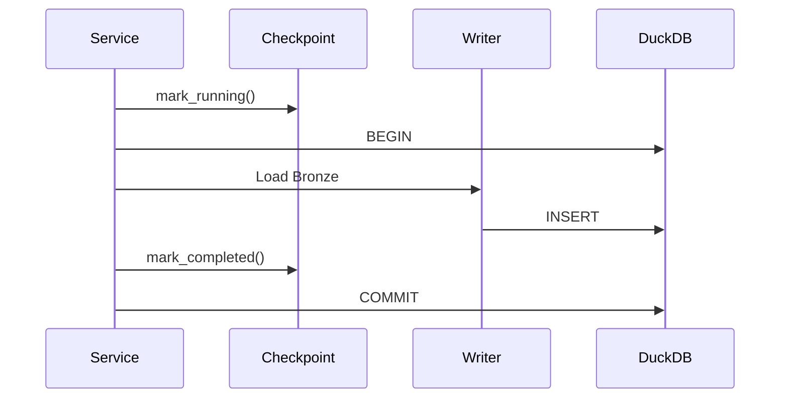

# Ingestion Architecture

## Overview

The ingestion layer is responsible for loading raw CDC (Change Data Capture) files into the Bronze layer.

The framework is designed to be:

- Configuration-driven
- Generic
- Transactional
- Idempotent
- Easy to extend

Rather than parsing JSON in Python, the pipeline delegates parsing and type conversion to DuckDB using `read_ndjson_auto()`. Python is responsible only for orchestration.

---

# Architecture



---

# Project Structure

```text
ingestion/
│
├── main.py
│
├── config/
│   ├── settings.py
│   └── constants.py
│
├── models/
│   └── dataset.py
│
├── database/
│   ├── duckdb_client.py
│   └── database_initializer.py
│
├── pipeline/
│   ├── checkpoint.py
│   ├── writer.py
│   └── service.py
|
├── utils/
│   └── logger.py
|
├── sql/
│   └── init.sql

```

---

# Responsibilities

| Component | Responsibility |
|------------|----------------|
| **main.py** | Application entry point |
| **IngestionService** | Orchestrates the ingestion workflow |
| **DatabaseInitializer** | Creates schemas and metadata tables |
| **Checkpoint** | Tracks ingestion state |
| **Writer** | Loads raw files into Bronze |
| **DuckDBClient** | Database abstraction and transaction management |
| **Dataset Registry** | Dataset metadata (table, source file, schema) |

---

# Ingestion Workflow



---

# Transaction Flow

Each dataset is processed within a single database transaction.



If any operation fails:

```text
ROLLBACK

↓

Bronze remains unchanged

↓

Checkpoint marked as FAILED
```

---

# Idempotency

The ingestion framework implements **file-level idempotency**.

Each processed file is tracked in:

```text
metadata.ingestion_runs
```

Example:

| filename | status |
|----------|---------|
| customer_sessions.json | COMPLETED |
| profiles.json | RUNNING |

Before loading a dataset, the pipeline checks the checkpoint table.

### First execution

```text
customer_sessions.json

↓

Not found

↓

Load Bronze

↓

COMPLETED
```

### Re-running the pipeline

```text
customer_sessions.json

↓

Status = COMPLETED

↓

Skip
```

The same file is **never loaded twice** after a successful ingestion.

### Failure during ingestion

```text
RUNNING

↓

BEGIN

↓

INSERT

↓

Exception

↓

ROLLBACK

↓

FAILED
```

Because Bronze loading occurs inside a transaction:

- Partial inserts are rolled back.
- Existing Bronze data remains unchanged.
- The dataset can be safely retried.

This guarantees that rerunning the pipeline does **not** introduce duplicate Bronze records.

---

# Dataset Registration

Datasets are defined declaratively.

```python
Dataset(
    table="customer_sessions",
    source_file="customer_sessions.json",
    columns=[...]
)
```

The ingestion engine automatically:

- Creates the Bronze table
- Generates SQL
- Applies type conversions
- Loads the dataset

Adding a new dataset only requires registering another `Dataset`.

---

## Running the Ingestion Pipeline

```bash
uv sync
uv run python -m ingestion.main
```

No additional setup is required.

The pipeline automatically:

- Creates the DuckDB database (if it doesn't exist)
- Initializes the required schemas and metadata tables
- Loads the Bronze layer
- Tracks ingestion progress using checkpoints

---

# Design Principles

- Single Responsibility Principle
- Configuration-driven architecture
- Generic ingestion engine
- Database performs parsing and type conversion
- Python orchestrates the workflow
- Transactional writes
- File-level idempotency
- Minimal code duplication
- Easy extensibility